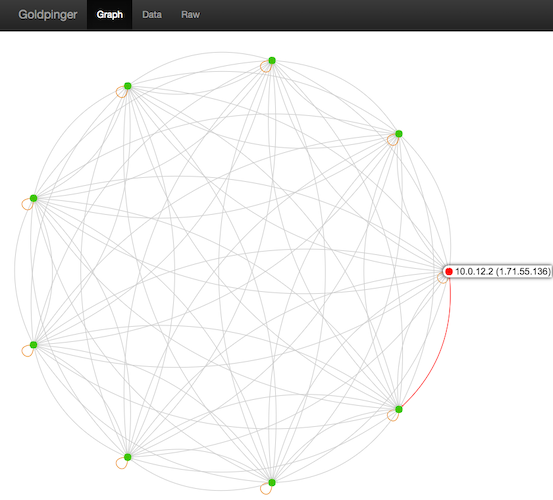
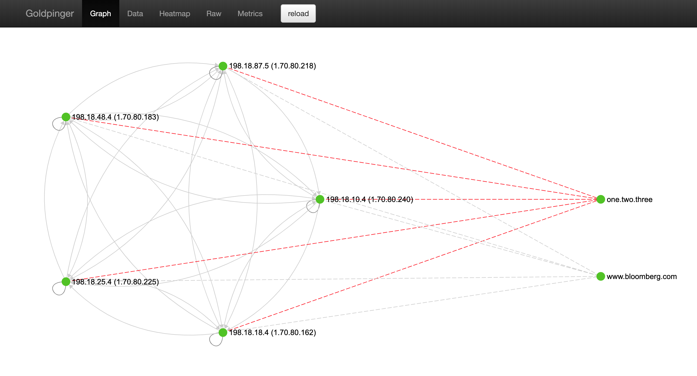
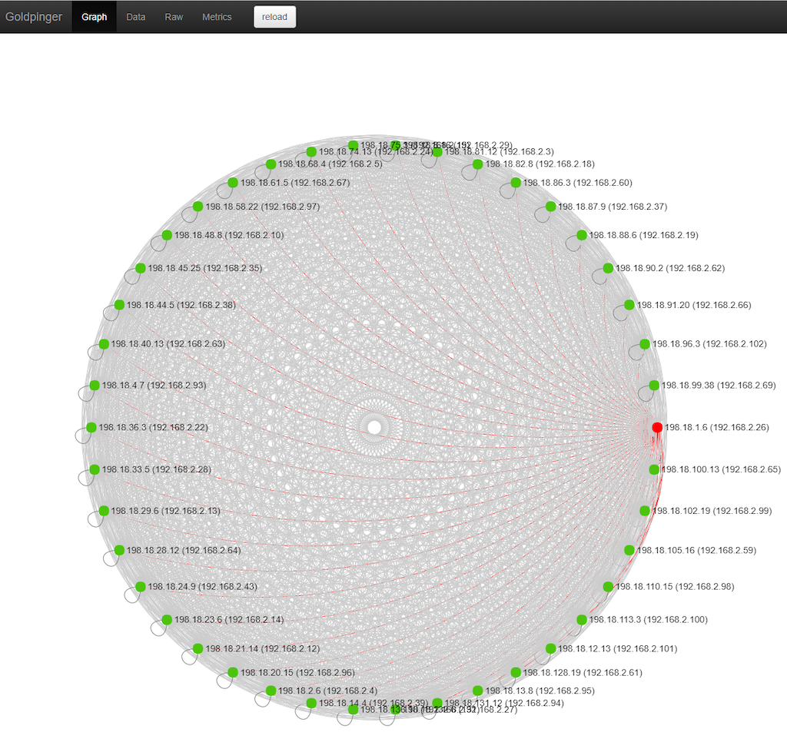

# Goldpinger

[](https://travis-ci.com/bloomberg/goldpinger)

__Goldpinger__ makes calls between its instances to monitor your networking.
It runs as a `DaemonSet` on `Kubernetes` and produces `Prometheus` metrics that can be [scraped](#prometheus), [visualised](#grafana) and [alerted](#alert-manager) on.

Oh, and it gives you the graph below for your cluster. Check out the [video explainer](https://youtu.be/DSFxRz_0TU4).




[:tada: 1M+ pulls from docker hub!](https://hub.docker.com/r/bloomberg/goldpinger/tags)

## On the menu

- [Goldpinger](#goldpinger)
  - [On the menu](#on-the-menu)
  - [Rationale](#rationale)
  - [Quick start](#quick-start)
  - [Building](#building)
    - [Compiling using a multi-stage Dockerfile](#compiling-using-a-multi-stage-dockerfile)
    - [Compiling locally](#compiling-locally)
  - [Installation](#installation)
    - [Authentication with Kubernetes API](#authentication-with-kubernetes-api)
    - [Example YAML](#example-yaml)
    - [Note on DNS](#note-on-dns)
  - [Usage](#usage)
    - [UI](#ui)
    - [API](#api)
    - [Prometheus](#prometheus)
    - [Grafana](#grafana)
    - [Alert Manager](#alert-manager)
    - [Chaos Engineering](#chaos-engineering)
  - [Authors](#authors)
  - [Contributions](#contributions)
  - [License](#license)

## Rationale

We built __Goldpinger__ to troubleshoot, visualise and alert on our networking layer while adopting `Kubernetes` at Bloomberg. It has since become the go-to tool to see connectivity and slowness issues.

It's small, simple and you'll wonder why you hadn't had it before.

If you'd like to know more, you can watch [our presentation at Kubecon 2018 Seattle](https://youtu.be/DSFxRz_0TU4).


## Quick start

Getting from sources:

```sh
go get github.com/bloomberg/goldpinger/cmd/goldpinger
goldpinger --help
```

Getting from [docker hub](https://hub.docker.com/r/bloomberg/goldpinger):

```sh
# get from docker hub
docker pull bloomberg/goldpinger:v3.0.0
```

## Building

The repo comes with two ways of building a `docker` image: compiling locally, and compiling using a multi-stage `Dockerfile` image. :warning: Depending on your `docker` setup, you might need to prepend the commands below with `sudo`.

### Compiling using a multi-stage Dockerfile

You will need `docker` version 17.05+ installed to support multi-stage builds.

```sh
# step 1: launch the build
make build-multistage

# step 2: push the image somewhere
namespace="docker.io/myhandle/" make tag
namespace="docker.io/myhandle/" make push
```

This was contributed via [@michiel](https://github.com/michiel) - kudos !

### Compiling locally

In order to build `Goldpinger`, you are going to need `go` version 1.13+ and `docker`.

Building from source code consists of compiling the binary and building a [Docker image](./build/Dockerfile-simple):

```sh
# step 0: check out the code
git clone https://github.com/bloomberg/goldpinger.git
cd goldpinger

# step 1: compile the binary for the desired architecture
make bin/goldpinger
# at this stage you should be able to run the binary
./bin/goldpinger --help

# step 2: build the docker image containing the binary
make build

# step 3: push the image somewhere
namespace="docker.io/myhandle/" make tag
namespace="docker.io/myhandle/" make push
```

## Installation

`Goldpinger` works by asking `Kubernetes` for pods with particular labels (`app=goldpinger`). While you can deploy `Goldpinger` in a variety of ways, it works very nicely as a `DaemonSet` out of the box.

### Authentication with Kubernetes API

`Goldpinger` supports using a `kubeconfig` (specify with `--kubeconfig-path`) or service accounts.

### Example YAML


Here's an example of what you can do (using the in-cluster authentication to `Kubernetes` apiserver).

```yaml
---
apiVersion: apps/v1
kind: DaemonSet
metadata:
  name: goldpinger
  namespace: default
  labels:
    app: goldpinger
spec:
  updateStrategy:
    type: RollingUpdate
  selector:
    matchLabels:
      app: goldpinger
  template:
    metadata:
      annotations:
        prometheus.io/scrape: 'true'
        prometheus.io/port: '8080'
      labels:
        app: goldpinger
    spec:
      serviceAccount: "goldpinger-serviceaccount"
      tolerations:
        - key: node-role.kubernetes.io/master
          effect: NoSchedule
      securityContext:
        runAsNonRoot: true
        runAsUser: 1000
        fsGroup: 2000
      containers:
        - name: goldpinger
          env:
            - name: HOST
              value: "0.0.0.0"
            - name: PORT
              value: "8080"
            # injecting real hostname will make for easier to understand graphs/metrics
            - name: HOSTNAME
              valueFrom:
                fieldRef:
                  fieldPath: spec.nodeName
            # podIP is used to select a randomized subset of nodes to ping.
            - name: POD_IP
              valueFrom:
                fieldRef:
                  fieldPath: status.podIP
          image: "docker.io/bloomberg/goldpinger:v3.0.0"
          imagePullPolicy: Always
          securityContext:
            allowPrivilegeEscalation: false
            readOnlyRootFilesystem: true
          resources:
            limits:
              memory: 80Mi
            requests:
              cpu: 1m
              memory: 40Mi
          ports:
            - containerPort: 8080
              name: http
          readinessProbe:
            httpGet:
              path: /healthz
              port: 8080
            initialDelaySeconds: 20
            periodSeconds: 5
          livenessProbe:
            httpGet:
              path: /healthz
              port: 8080
            initialDelaySeconds: 20
            periodSeconds: 5
---
apiVersion: v1
kind: Service
metadata:
  name: goldpinger
  namespace: default
  labels:
    app: goldpinger
spec:
  type: NodePort
  ports:
    - port: 8080
      nodePort: 30080
      name: http
  selector:
    app: goldpinger
```

Note, that you will also need to add an RBAC rule to allow `Goldpinger` to list other pods. If you're just playing around, you can consider a view-all default rule:

```yaml
---
apiVersion: rbac.authorization.k8s.io/v1beta1
kind: ClusterRoleBinding
metadata:
  name: default
roleRef:
  apiGroup: rbac.authorization.k8s.io
  kind: ClusterRole
  name: view
subjects:
  - kind: ServiceAccount
    name: default
    namespace: default
```

You can also see [an example of using `kubeconfig` in the `./extras`](./extras/example-with-kubeconfig.yaml).

### Note on DNS

Note, that on top of resolving the other pods, all instances can also try to resolve arbitrary DNS. This allows you to test your DNS setup.

From `--help`:

```sh
--host-to-resolve=      A host to attempt dns resolve on (space delimited) [$HOSTS_TO_RESOLVE]
```

So in order to test two domains, we could add an extra env var to the example above:

```yaml
            - name: HOSTS_TO_RESOLVE
              value: "www.bloomberg.com one.two.three"
```

and `goldpinger` should show something like this:




## Usage

### UI

Once you have it running, you can hit any of the nodes (port 30080 in the example above) and see the UI.



You can click on various nodes to gray out the clutter and see more information.

### API

The API exposed is via a well-defined [`Swagger` spec](./swagger.yml).

The spec is used to generate both the server and the client of `Goldpinger`. If you make changes, you can re-generate them using [go-swagger](https://github.com/go-swagger/go-swagger) via [`make swagger`](./Makefile)

### Prometheus

Once running, `Goldpinger` exposes `Prometheus` metrics at `/metrics`. All the metrics are prefixed with `goldpinger_` for easy identification.

You can see the metrics by doing a `curl http://$POD_ID:80/metrics`.

These are probably the droids you are looking for:

```sh
goldpinger_peers_response_time_s_*
goldpinger_peers_response_time_s_*
goldpinger_nodes_health_total
goldpinger_stats_total
goldpinger_errors_total
```

### Grafana

You can find an example of a `Grafana` dashboard that shows what's going on in your cluster in [extras](./extras/goldpinger-dashboard.json). This should get you started, and once you're on the roll, why not :heart: contribute some kickass dashboards for others to use ?

### Alert Manager

Once you've gotten your metrics into `Prometheus`, you have all you need to set useful alerts.

To get you started, here's a rule that will trigger an alert if there are any nodes reported as unhealthy by any instance of `Goldpinger`.

```yaml
alert: goldpinger_nodes_unhealthy
expr: sum(goldpinger_nodes_health_total{status="unhealthy"})
  BY (instance, goldpinger_instance) > 0
for: 5m
annotations:
  description: |
    Goldpinger instance {{ $labels.goldpinger_instance }} has been reporting unhealthy nodes for at least 5 minutes.
  summary: Instance {{ $labels.instance }} down
```

Similarly, why not :heart: contribute some amazing alerts for others to use ?

### Chaos Engineering

Goldpinger also makes for a pretty good monitoring tool in when practicing Chaos Engineering. Check out [PowerfulSeal](https://github.com/bloomberg/powerfulseal), if you'd like to do some Chaos Engineering for Kubernetes.

## Authors

Goldpinger was created by [Mikolaj Pawlikowski](https://github.com/seeker89) and ported to Go by Chris Green.


## Contributions

We :heart: contributions.

Have you had a good experience with `Goldpinger` ? Why not share some love and contribute code, dashboards and alerts ?

If you're thinking of making some code changes, please be aware that most of the code is auto-generated from the `Swagger` spec. The spec is used to generate both the server and the client of `Goldpinger`. If you make changes, you can re-generate them using [go-swagger](https://github.com/go-swagger/go-swagger) via [`make swagger`](./Makefile).

Before you create that PR, please make sure you read [CONTRIBUTING](./CONTRIBUTING.md) and [DCO](./DCO.md).

## License

Please read the [LICENSE](./LICENSE) file here.

For each version built by travis, there is also an additional version, appended with `-vendor`, which contains all source code of the dependencies used in `goldpinger`.
